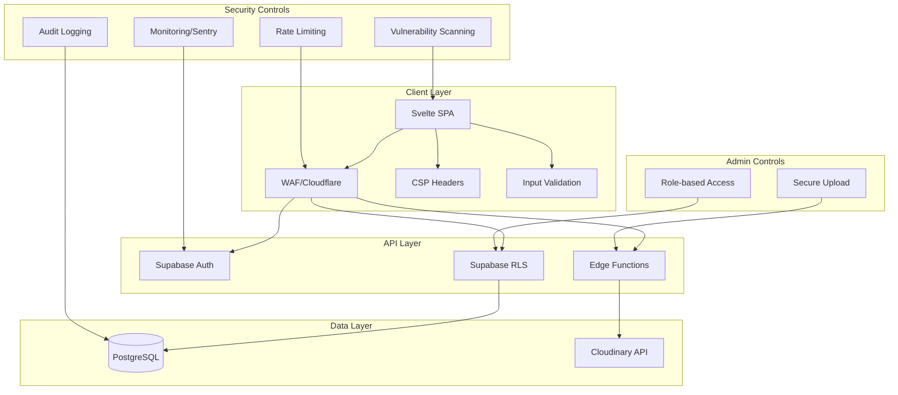

# Analisis Risiko Keamanan Informasi - OrbFood2

## Pendahuluan

Dokumen ini berisi analisis risiko keamanan untuk sistem OrbFood2, sebuah platform food ordering berbasis web yang menggunakan Svelte, Supabase, dan Cloudinary. Analisis ini mengidentifikasi potensi kerentanan dan merancang strategi mitigasi.

## Arsitektur Sistem

- **Frontend**: Svelte SPA
- **Backend**: Supabase (PostgreSQL + Auth + Edge Functions)
- **Media Storage**: Cloudinary
- **Authentication**: Supabase Auth dengan Google OAuth
- **Database Security**: Row Level Security (RLS)

## Identifikasi Risiko

### 1. Authentication & Authorization

#### Risiko:
- Admin access hanya dicek di client-side berdasarkan `profile.role`
- Tidak ada server-side validation untuk role-based access
- JWT tokens exposed di client-side

#### Dampak:
- Privilege escalation jika role diubah di client
- Unauthorized access ke admin functions

#### Likelihood: Medium
#### Severity: High

### 2. Input Validation & Sanitization

#### Risiko:
- Form inputs tidak memiliki validation yang ketat
- Blog content menggunakan `{@html}` tanpa sanitization
- User inputs langsung di-insert ke database tanpa escaping

#### Dampak:
- XSS attacks melalui blog content
- SQL injection (walaupun Supabase parameterized)
- Malformed data corruption

#### Likelihood: High
#### Severity: Medium-High

### 3. Image Upload Security

#### Risiko:
- Client-side upload ke Cloudinary dengan public preset
- Tidak ada rate limiting
- File type validation hanya di client

#### Dampak:
- Abuse of Cloudinary quota/billing
- Malicious file uploads
- DoS melalui large files

#### Likelihood: Medium
#### Severity: Medium

### 4. Database Security

#### Risiko:
- RLS policies mungkin tidak comprehensive
- Admin policies menggunakan recursive queries
- No audit logging

#### Dampak:
- Data leakage
- Unauthorized data access

#### Likelihood: Low-Medium
#### Severity: High

### 5. Client-Side Security

#### Risiko:
- Sensitive config (API keys) exposed di client
- No Content Security Policy (CSP)
- No HTTPS enforcement in config

#### Dampak:
- API key theft
- Man-in-the-middle attacks
- XSS injection points

#### Likelihood: Medium
#### Severity: Medium

### 6. API Security

#### Risiko:
- Supabase Edge Functions CORS permissive
- No rate limiting
- No input validation di functions

#### Dampak:
- API abuse
- DoS attacks

#### Likelihood: Low
#### Severity: Medium

## Strategi Mitigasi

### 1. Implementasi Web Application Firewall (WAF)

#### Rekomendasi:
- Deploy Cloudflare WAF atau AWS WAF
- Configure rules untuk:
  - SQL injection prevention
  - XSS filtering
  - Rate limiting per IP
  - Bot protection

#### Implementasi:
```javascript
// Contoh konfigurasi rate limiting
{
  "rules": [
    {
      "action": "block",
      "expression": "http.request.uri.path matches \"/api/\" and cf.threat_score > 10"
    }
  ]
}
```

### 2. Input Validation & Sanitization

#### Server-side Validation:
- Implement Zod atau Joi untuk schema validation
- Sanitize HTML content menggunakan DOMPurify

#### Client-side Validation:
- Tambahkan validation di semua forms
- Real-time feedback untuk user

### 3. Image Upload Security

#### Migrasi ke Server-side Upload:
- Gunakan Supabase Edge Function untuk upload
- Validate file types dan size di server
- Implement signed uploads untuk Cloudinary

#### Rate Limiting:
- Implement per-user upload limits
- File size restrictions (max 5MB)
- Type restrictions (JPG, PNG only)

### 4. Authentication & Authorization Enhancement

#### Server-side Role Checks:
- Buat RLS policies yang strict
- Validate roles di Edge Functions
- Implement proper session management

#### Admin Access Control:
```sql
-- Enhanced admin policy
CREATE POLICY "Strict admin access" ON admin_table
FOR ALL USING (
  EXISTS (
    SELECT 1 FROM user_profiles
    WHERE id = auth.uid() AND role = 'admin'
  )
);
```

### 5. Content Security Policy (CSP)

#### Implementasi CSP Header:
```
Content-Security-Policy: default-src 'self'; script-src 'self' 'unsafe-inline'; style-src 'self' 'unsafe-inline'; img-src 'self' data: https:;
```

#### HTTPS Enforcement:
- Redirect semua HTTP ke HTTPS
- HSTS header

### 6. Regular Vulnerability Scanning

#### Tools Recommended:
- OWASP ZAP untuk automated scanning
- Snyk untuk dependency scanning
- SonarQube untuk code analysis

#### Schedule:
- Weekly automated scans
- Monthly manual penetration testing
- Dependency updates monthly

### 7. Monitoring & Logging

#### Implementasi:
- Error logging dengan Sentry
- Security event logging
- Database audit trails

## Implementation Plan

### Phase 1: Critical Fixes (Week 1-2)
1. Input sanitization untuk blog content
2. Server-side image upload
3. Basic rate limiting
4. CSP headers

### Phase 2: Infrastructure Security (Week 3-4)
1. WAF deployment
2. HTTPS enforcement
3. Enhanced RLS policies
4. API security hardening

### Phase 3: Monitoring & Compliance (Week 5-6)
1. Vulnerability scanning setup
2. Security monitoring
3. Documentation
4. Security training

## Risk Matrix

| Risk | Likelihood | Impact | Priority |
|------|------------|--------|----------|
| Admin Access Bypass | Medium | High | Critical |
| XSS via Blog | High | Medium | High |
| Image Upload Abuse | Medium | Medium | Medium |
| Data Leakage | Low | High | Medium |
| API Abuse | Low | Medium | Low |

## Diagram Arsitektur Keamanan



## Kesimpulan

Sistem OrbFood2 memiliki beberapa kerentanan keamanan yang perlu segera diatasi, terutama pada input validation, image upload, dan admin access control. Implementasi WAF dan regular scanning akan significantly meningkatkan security posture.

## Next Steps

1. Review dan approve mitigation plan ini
2. Assign responsible parties untuk setiap task
3. Setup monitoring tools
4. Schedule regular security audits